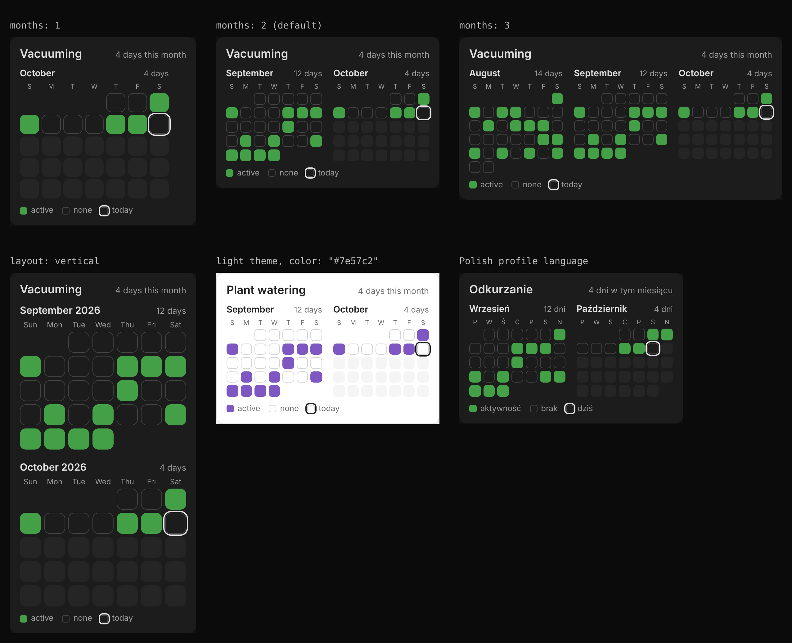
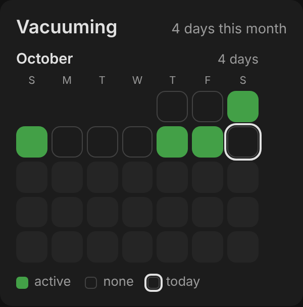
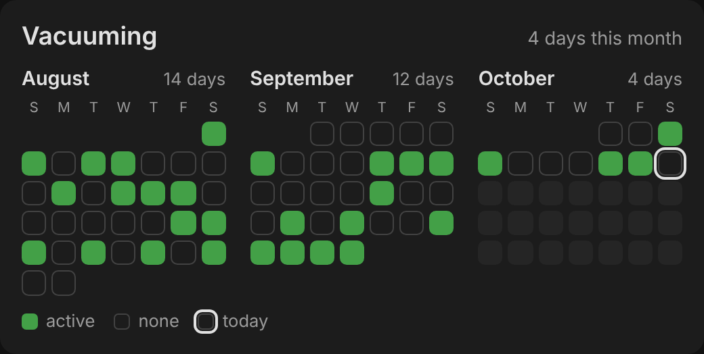
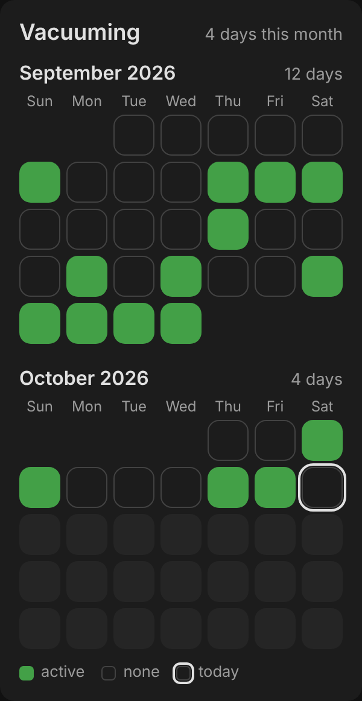
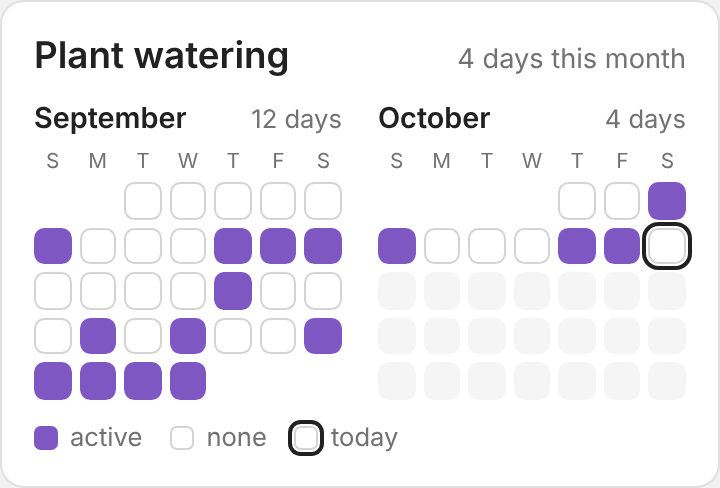
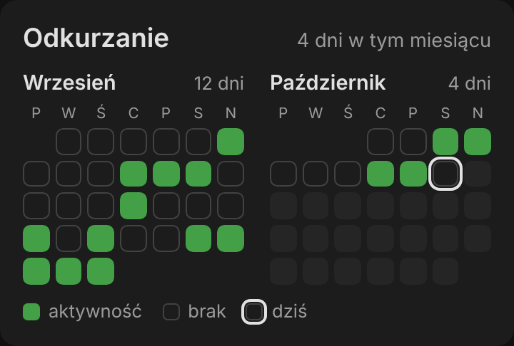

# Contributions Card

A Home Assistant dashboard card that shows a GitHub-style grid of days: a square
for every day, filled when the sensor you choose counted something that day.
Handy for "did the robot vacuum run?", "did I water the plants?", "how often
did the dishwasher run this month?" and anything else you can count.


- Shows the current month and up to two previous months.
- Reads the sensor's long-term statistics, so it is not limited by the recorder's
  history retention (10 days by default).
- Follows your Home Assistant profile: language (English and Polish so far),
  first day of the week, and the server's time zone for day boundaries.
- Uses theme colors, so it fits light and dark themes.

## Table of contents

- [Requirements](#requirements)
- [Installation](#installation)
  - [HACS (recommended)](#hacs-recommended)
  - [Manual installation (without HACS)](#manual-installation-without-hacs)
- [Configuration](#configuration)
- [Creating a counter sensor](#creating-a-counter-sensor)
- [Troubleshooting](#troubleshooting)
- [Translations](#translations)
- [Development](#development)

## Requirements

The card needs a **counter sensor with long-term statistics**: a `sensor`
whose `state_class` is `total` or `total_increasing` and whose value goes up
each time the thing happens. Many integrations provide one already, for example
a robot vacuum's "total cleaning count" or a washing machine's "total cycles".

A day is shown as active when the sensor's daily statistics went up that day.

If your device has no such sensor, you can build one from almost anything:
an on/off state, a number without a state class, or an event. See
[Creating a counter sensor](#creating-a-counter-sensor).

## Installation

### HACS (recommended)

Installing through the [Home Assistant Community Store](https://hacs.xyz/)
gives you updates for the card in the same place as your other updates.

[](https://my.home-assistant.io/redirect/hacs_repository/?owner=adamzimnyy&repository=contributions-card&category=frontend)

1. If you don't have HACS yet, [download](https://hacs.xyz/docs/use/download/download/)
   and [configure](https://hacs.xyz/docs/use/configuration/basic/) it first.
2. Click the button above. It opens your Home Assistant and shows Contributions
   Card in HACS. If HACS asks whether to add the repository, confirm.

   Or add it by hand: open **HACS** from the sidebar, open the menu (⋮) in the
   top-right corner, choose **Custom repositories**, enter
   `https://github.com/adamzimnyy/contributions-card`, set the type to
   **Dashboard** and click **Add**. Then search HACS for **Contributions Card**.
3. Click **Download** and confirm.
4. Reload the browser tab (on phones, close and reopen the Home Assistant app).
5. Open your dashboard, open the menu (⋮) in the top-right corner and choose
   **Edit dashboard**.
6. Click **Add card** and search for **Contributions Card**.

HACS registers the card as a dashboard resource for you, and updates appear
under **Settings → Updates** like any other.

### Manual installation (without HACS)

<details>
<summary>Show the manual installation steps</summary>

1. Download [`contributions-card.js`](dist/contributions-card.js) from the
   `dist` folder.
2. Copy it to the `www` folder in your Home Assistant configuration folder
   (create the folder if it doesn't exist), so the path is
   `<config>/www/contributions-card.js`.
3. On your dashboard, open the menu (⋮) in the top-right corner and choose
   **Edit dashboard**.
4. Open the menu again and choose **Manage resources**.
5. Click **Add resource**.
6. Enter the URL `/local/contributions-card.js?v=1`.
7. Set the resource type to **JavaScript module** and click **Create**.
8. Go back to the dashboard and reload the page.
9. Click **Add card** and search for **Contributions Card**.

To update a manual install, replace the file and raise the number after `?v=`
in the resource URL (for example `?v=2`). The new number makes browsers load
the new copy instead of a cached one.

</details>

## Configuration

The card can be added from the card picker and set up in the visual editor, or
in YAML:

```yaml
type: custom:contributions-card
entity: sensor.robot_vacuum_total_cleaning_count
```

| Option | Type | Default | Description |
| --- | --- | --- | --- |
| `entity` | string | **required** | Counter sensor with long-term statistics (`state_class: total` or `total_increasing`). |
| `months` | number | `2` | How many months to show, counting the current one. `1` to `3`. |
| `title` | string | sensor name | Card title. Use `""` to hide it. |
| `layout` | string | `horizontal` | `horizontal` puts months side by side; `vertical` puts them one under another at full width. |
| `last_activity_entity` | string | — | Optional timestamp sensor with the time of the most recent activity (for example "last clean start"). Daily statistics for today are only complete after midnight; this sensor makes today light up straight away. |
| `color` | string | theme success color | Color of active days, any CSS color. |
| `cell_size` | number or string | — | Largest size of a day square. A number is in pixels (`24`); a string is any CSS length (`"2em"`, `"calc((100vh - 430px) / 12)"`). Squares never get smaller than 16 px, so a formula that drops to zero or below on a short screen still leaves a usable grid. |

### Examples



Each example below shows the card and its configuration. All of them use the
same sensor; only the options change.

<details>
<summary><code>months: 1</code>, just the current month</summary>



```yaml
type: custom:contributions-card
entity: sensor.robot_vacuum_total_cleaning_count
title: Vacuuming
months: 1
```

</details>

<details>
<summary><code>months: 2</code>, the default</summary>


```yaml
type: custom:contributions-card
entity: sensor.robot_vacuum_total_cleaning_count
title: Vacuuming
```

</details>

<details>
<summary><code>months: 3</code>, side by side on a wide card</summary>



```yaml
type: custom:contributions-card
entity: sensor.robot_vacuum_total_cleaning_count
title: Vacuuming
months: 3
```

On a narrow card, months that don't fit side by side wrap to the next row.

</details>

<details>
<summary><code>layout: vertical</code>, months one under another</summary>



```yaml
type: custom:contributions-card
entity: sensor.robot_vacuum_total_cleaning_count
last_activity_entity: sensor.robot_vacuum_last_clean_begin
title: Vacuuming
layout: vertical
```

Day squares grow with the card's width. To keep them smaller, or to fit two
stacked months into the height of the window next to another card, add
`cell_size`:

```yaml
cell_size: calc((100vh - 430px) / 12)
```

On a short screen, such as a phone held sideways, a formula like this can drop
to zero or below. The card then uses its 16 px minimum; to choose a different
minimum, wrap the formula in `max()`:

```yaml
cell_size: max(30px, calc((100vh - 430px) / 12))
```

</details>

<details>
<summary><code>color</code>, a custom color for active days (light theme)</summary>



```yaml
type: custom:contributions-card
entity: sensor.plant_watering_count
title: Plant watering
color: "#7e57c2"
```

Everything else follows your theme. The active color can also be set in a
theme with the `contributions-active-color` variable.

</details>

<details>
<summary>Another language: Polish profile, week starting on Monday</summary>



```yaml
type: custom:contributions-card
entity: sensor.robot_vacuum_total_cleaning_count
title: Odkurzanie
```

Language and the first day of the week come from your Home Assistant profile;
there is nothing to configure in the card. See [Translations](#translations)
to add a language.

</details>

## Creating a counter sensor

The card works with any sensor that Home Assistant keeps long-term statistics
for and that goes up when the thing you track happens. Home Assistant keeps
those statistics for sensors with a **state class** of `total` or
`total_increasing`. To check a sensor, open it in **Settings → Devices &
services → Entities**, open **Attributes**, and look for `state_class`.

A `total_increasing` counter may reset to zero (every night, or when a device
restarts). Home Assistant treats a drop as the start of a new count, so daily
results stay correct.

Statistics start when the sensor is created. A new counter shows activity from
that day on; earlier days stay empty.

### Which method should I use?

| What you have | What you want to count | Method |
| --- | --- | --- |
| An entity that switches state: a `binary_sensor`, `switch`, vacuum, washing machine "running" sensor, door contact | Days on which it was in a state, for example "on" or "cleaning" | [History stats helper](#history-stats-helper-no-yaml) |
| A number that goes up but has no state class, or resets on its own | Days on which the number went up | [Utility meter helper](#utility-meter-helper-no-yaml) |
| Events: button presses, NFC tag scans, an automation running, a script you start | Each event, exactly | [Counter helper + template helper](#counter-helper--template-helper-no-yaml) or [trigger-based template sensor](#trigger-based-template-sensor-yaml) |

Each method below shows the UI steps first and the equivalent YAML second.
Replace the example entity IDs with your own.

### History stats helper (no YAML)

[History stats](https://www.home-assistant.io/integrations/history_stats/)
counts how many times an entity was in a given state during a period. Counting
"today" and marking it `total_increasing` gives a counter that resets every
midnight, which is all the card needs.

<details>
<summary>Show setup steps and YAML</summary>

1. Go to **Settings → Devices & services → Helpers**, click **Create helper**
   and choose **History stats**.
2. Pick the entity to watch, and enter the state to count, for example `on` for
   a binary sensor or `cleaning` for a vacuum.
3. Set **Type** to **Count**.
4. Set **Start** to `{{ today_at() }}` and **End** to `{{ now() }}`.
5. Set **State class** to **Total increasing**.
6. Use the new sensor as the card's `entity`.

YAML equivalent (in `configuration.yaml`):

```yaml
sensor:
  - platform: history_stats
    name: Dishwasher runs today
    unique_id: dishwasher_runs_today
    entity_id: binary_sensor.dishwasher_running
    state: "on"
    type: count
    start: "{{ today_at() }}"
    end: "{{ now() }}"
    state_class: total_increasing
```

Good to know:

- History stats counts the times the entity *was* in the state during the
  period, not only the times it switched into it. A device that is still on at
  midnight counts as active on the next day too.
- To ignore short blips, set **Minimum state duration** under **Additional
  settings** (`min_state_duration` in YAML), for example to one minute.

</details>

### Utility meter helper (no YAML)

A [utility meter](https://www.home-assistant.io/integrations/utility_meter/)
follows a numeric sensor and keeps its own running total, which always has the
`total_increasing` state class. Use it when a device reports a number that goes
up (total cycles, total runs) but has no state class, or when its number resets
on its own (for example a "runs today" value that restarts at midnight or after
a power cut).

<details>
<summary>Show setup steps and YAML</summary>

1. Go to **Settings → Devices & services → Helpers**, click **Create helper**
   and choose **Utility meter**.
2. Set **Input sensor** to the device's number.
3. Set **Meter reset cycle** to **No cycle**, so the total never resets on a
   schedule. Leave the other options as they are.
4. Use the utility meter sensor as the card's `entity`.

YAML equivalent:

```yaml
utility_meter:
  washing_machine_cycles:
    source: sensor.washing_machine_cycle_count
```

When the source drops (a reset), the utility meter ignores the drop and keeps
adding from the new value, so its total only goes up. The source must be a
number; for something that switches state, use
[History stats](#history-stats-helper-no-yaml) instead.

</details>

### Counter helper + template helper (no YAML)

Use this to count events exactly: every button press, every time an automation
runs, every door opening. A
[counter helper](https://www.home-assistant.io/integrations/counter/) holds the
number, but counters have no state class, so a
[template sensor helper](https://www.home-assistant.io/integrations/template/)
copies it into a sensor that has one.

<details>
<summary>Show setup steps and YAML</summary>

1. Go to **Settings → Devices & services → Helpers**, click **Create helper**,
   choose **Counter** and name it, for example "Plant watering".
2. Add a **Counter: Increment** action for that counter to whatever should
   count: the automation that runs when you scan an NFC tag, a dashboard
   button, the end of a script.
3. Click **Create helper** again, choose **Template**, then **Sensor**, and
   fill in:
   - **State**: `{{ states('counter.plant_watering') | int(0) }}`
   - **State class**: **Total increasing**
   - Under **Additional options**, **Availability**:
     `{{ has_value('counter.plant_watering') }}`
4. Use the template sensor as the card's `entity`.

Automation step for step 2, in YAML:

```yaml
actions:
  - action: counter.increment
    target:
      entity_id: counter.plant_watering
```

The counter keeps its value across restarts. Resetting it to zero is fine: the
statistics treat that as a new count.

The availability template matters. Without it, the template sensor reports `0`
while the counter is unavailable (for example during a restart). Home Assistant
reads that `0` as a reset, and when the real value comes back it counts the
whole total again, which can light up a day by mistake. The same applies
whenever a template copies another number.

</details>

### Trigger-based template sensor (YAML)

A trigger-based
[template sensor](https://www.home-assistant.io/integrations/template/) can
count on its own, without a separate counter: each time its trigger fires, it
adds one to its own value (`this.state`). Home Assistant restores the value
after a restart. Trigger-based templates can only be written in YAML.

<details>
<summary>Show setup steps and YAML</summary>

```yaml
template:
  - triggers:
      - trigger: state
        entity_id: binary_sensor.dishwasher_running
        from: "off"
        to: "on"
    sensor:
      - name: Dishwasher runs
        unique_id: dishwasher_runs
        state: "{{ this.state | int(0) + 1 }}"
        state_class: total_increasing
```

Any trigger works, for example an `event` entity from a button, a `tag` scan,
or a `time` trigger combined with a condition. Because `from: "off"` and
`to: "on"` are both set, the sensor counts each start once and ignores the
device dropping to `unavailable` and back.

After adding it, reload template entities in the YAML tab of **Tools**
(**Developer tools** before Home Assistant 2026.8), or restart Home Assistant.

</details>

### A number that already counts, but without a state class

If a device already reports a total that only goes up, but without a state
class, the [utility meter](#utility-meter-helper-no-yaml) method is the
simplest fix. A template helper also works: set **State** to
`{{ states('sensor.your_total') | float(0) }}`, **State class** to **Total
increasing**, and **Availability** to `{{ has_value('sensor.your_total') }}`.
Don't skip the availability template, for the reason
[explained above](#counter-helper--template-helper-no-yaml).

## Troubleshooting

<details>
<summary>The card isn't in the card picker, or says "Custom element doesn't exist".</summary>

Clear the browser cache (in the Home Assistant Companion app, use
**Reset frontend cache** in the app's settings), then reload. For a manual
install, check the resource URL and type (**JavaScript module**).

</details>

<details>
<summary>"… has no long-term statistics".</summary>

The sensor has no `state_class`. Use one
of the methods in [Creating a counter sensor](#creating-a-counter-sensor).

</details>

<details>
<summary>Today doesn't light up until later.</summary>

Daily statistics are compiled through
the day. Set `last_activity_entity` to a timestamp sensor of the most recent
activity to mark today straight away.

</details>

<details>
<summary>A day you didn't expect is lit.</summary>

For template sensors, add an availability
template (see [above](#counter-helper--template-helper-no-yaml)). For History
stats, remember that a device still on at midnight counts for the next day.

</details>

## Translations

The card follows the language set in your Home Assistant profile. It ships
with English and Polish; any other language shows English text (month and
weekday names are still localized by the browser).

<details>
<summary>How to add or change a translation</summary>

Translations are plain text files in the [`translations`](translations)
folder, one per language, named by the language code Home Assistant uses:
`de.properties`, `pt-BR.properties`. Each line is a `key = value` pair:

```properties
# Lines starting with # are comments
legend.today = today
error.entity_missing = Entity not found: {entity}
```

- `{name}` is a placeholder for a value the card fills in, such as `{count}`
  or `{entity}`. Keep placeholders exactly as they are in English.
- Keys ending in `.one`, `.two`, `.few`, `.many`, `.zero` and `.other` are
  plural forms. Write the forms your language uses and always include `.other`.
  English uses `.one` and `.other`; Polish uses `.one`, `.few` and `.many`. The
  [CLDR plural rules](https://www.unicode.org/cldr/charts/latest/supplemental/language_plural_rules.html)
  list the forms for each language.
- A key you leave out shows the English text, so a partial translation still
  works.

To add or change a language:

1. Copy `translations/en.properties` to `translations/<language>.properties`
   (or edit an existing file) and translate the values. Leave the keys as they
   are.
2. Run `npm run build` (Node.js 18 or newer, no `npm install` needed). The
   build checks every file against `en.properties` and reports unknown keys,
   changed placeholders and missing plural forms, then bundles all languages
   into `dist/contributions-card.js`.
3. Commit both the `.properties` file and the rebuilt `dist/contributions-card.js`,
   and open a pull request.

</details>

## Development

<details>
<summary>Project layout and build</summary>

| Path | What it is |
| --- | --- |
| `src/contributions-card.js` | Card source. Edit this, not `dist/`. |
| `translations/*.properties` | Text for each language. |
| `scripts/build.mjs` | Bundles the source and translations into `dist/`. No dependencies. |
| `dist/contributions-card.js` | The built card that HACS and manual installs use. Committed to the repository. |

Run `npm run build` after changing the source or a translation, and commit the
rebuilt `dist/contributions-card.js` with your change. `npm run check` (also
run on every pull request) fails if a translation is invalid or `dist/` is out
of date.

</details>
