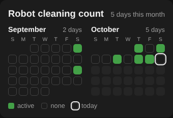

# Contributions Card

A Home Assistant dashboard card that shows a GitHub-style grid of days: a square
for every day, filled when the sensor you choose counted something that day.
Handy for "did the robot vacuum run?", "did I water the plants?", "how often
did the dishwasher run this month?" and anything else that has a counter.



- Shows the current month and up to two previous months.
- Reads the sensor's long-term statistics, so it is not limited by the recorder's
  history retention (10 days by default).
- Follows your Home Assistant profile: language (English and Polish so far),
  first day of the week, and the server's time zone for day boundaries.
- Uses theme colors, so it fits light and dark themes.

## Requirements

The card needs a **counter sensor with long-term statistics**: a `sensor`
whose `state_class` is `total` or `total_increasing` and whose value goes up
each time the thing happens. Many integrations provide one already, for example
a robot vacuum's "total cleaning count". Sensors that only switch on and off are
not supported yet.

A day is shown as active when the sensor's daily statistics went up that day.

## Installation

### HACS (custom repository)

1. In HACS, open the menu (⋮) and choose **Custom repositories**.
2. Add `https://github.com/adamzimnyy/contributions-card` with the type **Dashboard**.
3. Find **Contributions Card** in HACS and download it.
4. Reload your browser.

### Manual

1. Copy `dist/contributions-card.js` to `/config/www/contributions-card.js`.
2. Go to **Settings → Dashboards → ⋮ → Resources** and add
   `/local/contributions-card.js` as a **JavaScript module**.
3. Reload your browser. When you update the file later, add a version to the
   resource URL (for example `/local/contributions-card.js?v=0.1.0`) so browsers
   load the new copy.

## Configuration

The card can be added from the card picker and configured in the visual editor,
or in YAML:

```yaml
type: custom:contributions-card
entity: sensor.robot_vacuum_total_cleaning_count
```

| Option | Type | Default | Description |
| --- | --- | --- | --- |
| `entity` | string | **required** | Counter sensor with long-term statistics (`state_class: total` or `total_increasing`). |
| `months` | number | `2` | How many months to show, counting the current one. `1` to `3`. |
| `title` | string | sensor name | Card title. Use `""` to hide it. |
| `layout` | string | `horizontal` | `horizontal` puts months side by side; `vertical` puts them one under another at full width. |
| `last_activity_entity` | string | — | Optional timestamp sensor with the time of the most recent activity (for example "last clean start"). Daily statistics for today are only complete after midnight; this sensor makes today light up straight away. |
| `color` | string | theme success color | Color of active days, any CSS color. |
| `cell_size` | number or string | — | Largest size of a day square. A number is in pixels (`24`); a string is any CSS length (`"2em"`, `"calc((100vh - 430px) / 12)"`). |

### Examples

Three months, one under another, with today's activity picked up immediately:

```yaml
type: custom:contributions-card
entity: sensor.robot_vacuum_total_cleaning_count
last_activity_entity: sensor.robot_vacuum_last_clean_begin
title: Vacuuming
months: 3
layout: vertical
```

Fit two stacked months into the height of the window next to another card:

```yaml
type: custom:contributions-card
entity: sensor.dishwasher_cycles
layout: vertical
cell_size: calc((100vh - 430px) / 12)
```

The active color can also be set from a theme with the
`contributions-active-color` variable.

## Development

There is no build step: `dist/contributions-card.js` is the card. Open a pull
request against that file, and run `node --check dist/contributions-card.js`
before pushing.

Translations live in the `STRINGS` object at the top of the file. To add a
language, copy the `en` block, key it by the language code Home Assistant uses
(for example `de`), and translate the strings.
